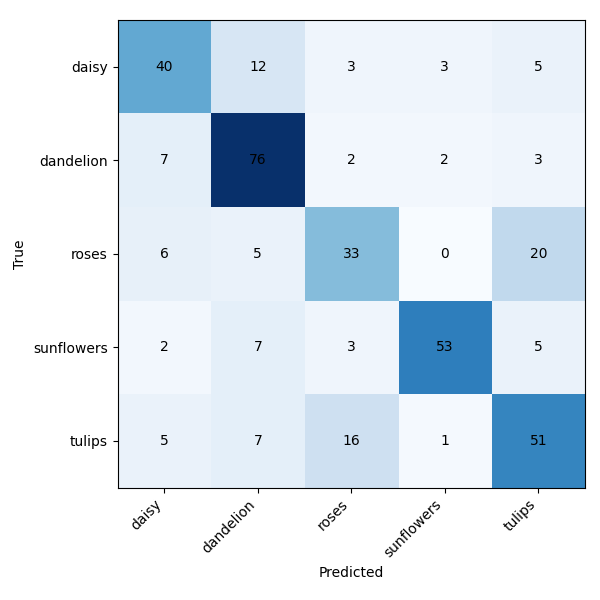

#  Flower Image Classification API

A fully reproducible, production-ready AI project that classifies flower images via a FastAPI endpoint, powered by a custom-trained deep learning model (TensorFlow/Keras).

---

##  Project Overview

- **Goal:** Deploy a robust, Dockerized API for image classification using a custom CNN trained on the [TensorFlow Flowers dataset](https://www.tensorflow.org/datasets/catalog/tf_flowers).
- **What it does:** Accepts image uploads, returns predicted class (daisy, dandelion, rose, sunflower, tulip) and probabilities for all classes.
- **Why:** Demonstrates deep learning, software engineering, MLOps, and reproducible research

---

##  Project Structure
```bash
├── src/
│ ├── train.py # Training pipeline
│ ├── models/ # Saved model (not committed)
│ │ ├── model.keras 
│ │ └── class_names.txt
│ └── api/
│ ├── main.py # FastAPI app
│ └── predictor.py # Model loading and prediction logic
├── data/ # Training data (not committed)
├── test_images/ # Images for manual or automated testing
├── requirements.txt
├── Dockerfile
├── .gitignore
└── README.md 
```
---

##  Quickstart

### 1. **Clone & Install**

```bash
git clone https://github.com/Gabijajulio18/image-classifier-api.git
cd image-classifier-api
python3 -m venv venv
source venv/bin/activate
pip install -r requirements.txt
```

### 2. **Prepare Data**

Download and extract the [flowers_photos.tgz](https://www.tensorflow.org/datasets/catalog/tf_flowers):

```bash
wget https://storage.googleapis.com/download.tensorflow.org/example_images/flower_photos.tgz
mkdir -p data
tar -xzf flower_photos.tgz -C data

```

### 3. **Train Model**

```bash
python src/train.py
```

### 4. **Run API**

```bash
uvicorn src.api.main:app --reload
```
- Visit http://localhost:8000/docs to upload an image and get predictions.

### 5. **Example API Call**

```bash
curl -X POST "http://localhost:8000/predict" \
    -H "accept: application/json" \
    -H "Content-Type: multipart/form-data" \
    -F "file=@test_images/your_flower.jpg"
```
### 6. **Example Output**

```bash
{
  "class": "daisy",
  "confidence": 0.934,
  "all_probs": {
    "daisy": 0.934,
    "dandelion": 0.017,
    "roses": 0.010,
    "sunflowers": 0.024,
    "tulips": 0.015
  }
}
```
---

# Model Details

- **Architecture**: Custom CNN with 3 Conv2D + MaxPooling blocks, 1 Dense hidden layer, softmax output

- **Preprocessing**: Rescale to [0,1], resize to 180x180, RGB

- **Loss**: SparseCategoricalCrossentropy (from_logits=True for logits version)

- **Metrics**: Accuracy, per-class probabilities

---

# Model Evaluation

The model was evaluated on a held-out test set of 367 images.

- **Accuracy:** 0.689
- **Macro F1:** 0.682
- **Weighted F1:** 0.688



The raw classification report and numeric confusion matrix are available in
`evaluation_results/`.

---

# Docker Usage

This project is fully containerized. You can build and run the API using Docker for consistent, portable deployment.

## **Build the Docker Image**

```bash
docker build -t flower-api .
```


## **Run the API Container**

```bash
docker run -p 8000:8000 flower-api
```
- The API will be available at http://localhost:8000/docs

## **Test the API**

 Visit `/docs` in your browser or use `curl`:

```bash
curl -X POST "http://localhost:8000/predict" \
    -H "accept: application/json" \
    -H "Content-Type: multipart/form-data" \
    -F "file=@test_images/daisy1.jpg"
```

**Note:**  
- Make sure your trained model (`src/models/model.keras` and `src/models/class_names.txt`) exists **before** building the image.
- The API does not need the training data to run—only the model and class file.

--- 


# Licence

**MIT**