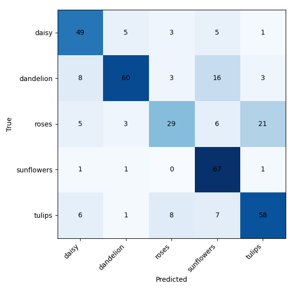
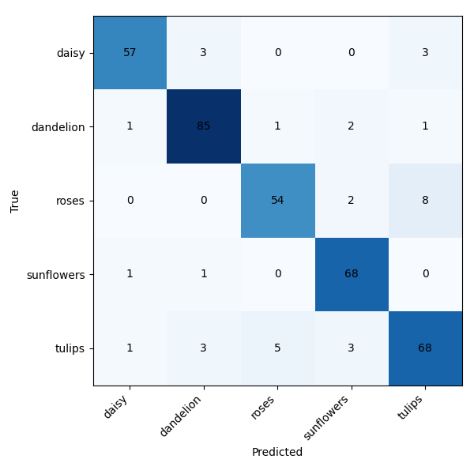

#  Flower Image Classification API

A fully reproducible, production-ready AI project that classifies flower images via a FastAPI endpoint, powered by a custom-trained deep learning model (TensorFlow/Keras).

---

##  Project Overview

- **Goal:** Deploy a robust, Dockerized API for image classification using a custom CNN trained on the [TensorFlow Flowers dataset](https://www.tensorflow.org/datasets/catalog/tf_flowers).
- **What it does:** Accepts image uploads, returns predicted class (daisy, dandelion, rose, sunflower, tulip) and probabilities for all classes.
- **Why:** Demonstrates deep learning, software engineering, MLOps, and reproducible research

---

##  Project Structure
```bash
├── src/
│   ├── api/
│   │   ├── main.py          # FastAPI app
│   │   └── predictor.py     # Model loading and inference
│   ├── download_data.py     # Fetch the dataset
│   ├── train.py             # Baseline training pipeline
│   ├── train_transfer.py    # Transfer learning training
│   ├── evaluate.py          # Evaluate a saved model
│   ├── compare_models.py    # Compare baseline vs transfer
│   └── models/              # Saved model artifacts (not committed)
│       └── class_names.txt
├── analysis/                # Metrics and error analysis scripts
├── evaluation_results/      # Stored evaluation outputs
├── misclassified_examples/  # Example misclassified images
├── data/                    # Dataset (not committed)
├── Dockerfile
├── pyproject.toml
├── requirements.txt
└── README.md
```
---

##  Quickstart

### 1. **Clone & Install**

```bash
git clone https://github.com/Gabijajulio18/image-classifier-api.git
cd image-classifier-api
python3 -m venv venv
source venv/bin/activate
pip install -r requirements.txt
```

### 2. **Prepare Data**

Download the training dataset (around 200MB) using the helper script. This will
also create a small `flower_photos_test` folder used for evaluation:

```bash
python src/download_data.py data --with-test --test-count 20
```

### 3. **Train Model**

```bash
python src/train.py --train-dir data/flower_photos --epochs 50 # see --help for options
```

### 4. **Run API**

```bash
uvicorn src.api.main:app --reload
```
- Visit http://localhost:8000/docs to upload an image and get predictions.

### 5. **Example API Call**

```bash
curl -X POST "http://localhost:8000/predict" \
    -H "accept: application/json" \
    -H "Content-Type: multipart/form-data" \
    -F "file=@test_images/your_flower.jpg"
```
### 6. **Example Output**

```bash
{
  "class": "daisy",
  "confidence": 0.934,
  "all_probs": {
    "daisy": 0.934,
    "dandelion": 0.017,
    "roses": 0.010,
    "sunflowers": 0.024,
    "tulips": 0.015
  }
}
```
---

## Reproducing Experiments

Training and evaluation commands log results to `experiments.csv`.
Run the MobileNetV2 transfer experiment with:

```bash
python src/train_transfer.py --train-dir data/flower_photos 
       --model-out src/models/transfer_model.keras
```

A new row will be appended with metrics for each run.

---

# Model Details

- **Architecture**: Custom CNN with 3 Conv2D + MaxPooling blocks, 1 Dense hidden layer, softmax output

- **Augmentation**: RandomFlip, RandomRotation, RandomZoom, RandomContrast and RandomTranslation

- **Preprocessing**: Rescale to [0,1], resize to 180x180, RGB

- **Loss**: SparseCategoricalCrossentropy (from_logits=True for logits version)

- **Metrics**: Accuracy, per-class probabilities

---

# Baseline Model Evaluation

The model was evaluated on a held-out test set of 367 images.

- **Accuracy:** 0.717
- **Macro F1:** 0.705
- **Weighted F1:** 0.710



The raw classification report and numeric confusion matrix are available in
`evaluation_results/`.

---

### Confusion Matrix Insights

- **Roses vs Tulips:** 21 rose images were predicted as tulips and 8 tulips as roses.
- **Daisy vs Dandelion:** 5 daisies were classified as dandelions and 8 dandelions as daisies.
- **Other Classes:** Misclassifications for sunflowers were mostly against dandelions.

The class distribution is moderately imbalanced (`support` ranges from 63 to 90
images) which may contribute to these confusions. Visual similarity between
roses and tulips is also a likely cause.

### Current Issues

- Moderate overfitting despite basic augmentation.
- Largest errors come from visually similar classes.
- The custom CNN may be underpowered compared to modern pretrained
  architectures.

Further error analysis (e.g., inspecting the saved misclassified images using
`analysis/error_analysis.py`) can reveal if data quality is a factor.

---

# Baseline vs Transfer Learning 

The current model is a custom CNN trained from scratch. A forthcoming update
will train a MobileNetV2 model using transfer learning and compare its
performance against the baseline. We expect the pretrained model to converge
faster and yield higher accuracy.

| Model | Accuracy | Macro F1 |
|-------|---------:|---------:|
| Baseline CNN | 0.717 | 0.705 |
| MobileNetV2 | 0.905 | 0.904 |



# Docker Usage

This project is fully containerized. You can build and run the API using Docker for consistent, portable deployment.

## **Build the Docker Image**

```bash
docker build -t flower-api .
```


## **Run the API Container**

```bash
docker run -p 8000:8000 flower-api
```
- The API will be available at http://localhost:8000/docs

## **Test the API**

 Visit `/docs` in your browser or use `curl`:

```bash
curl -X POST "http://localhost:8000/predict" \
    -H "accept: application/json" \
    -H "Content-Type: multipart/form-data" \
    -F "file=@test_images/daisy1.jpg"
```

**Note:**  
- Make sure your trained model (`src/models/model.keras` and `src/models/class_names.txt`) exists **before** building the image.
- The API does not need the training data to run—only the model and class file.

--- 


# Licence

**MIT**